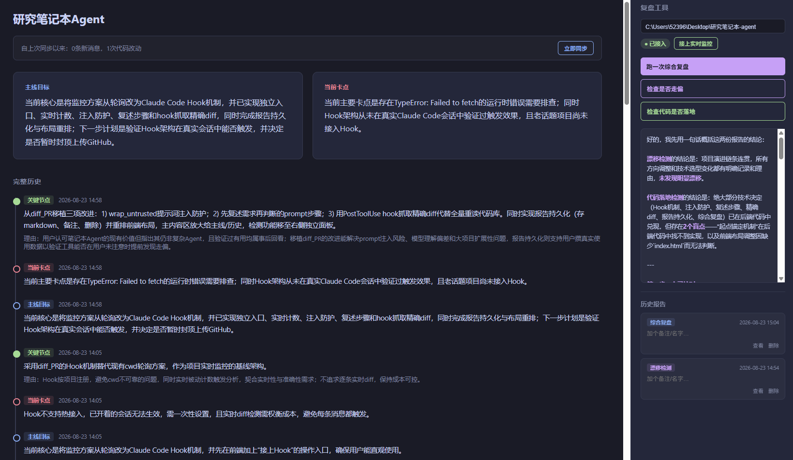

# 罗盘

给一个身兼产品经理和工程开发的个人开发者，在vibe coding的时候不丢主线——自动记录"在做什么、卡在哪、做过什么决定"，随时能问它"我是不是走偏了"、"决定有没有真的落地到代码里"，给证据支撑的判断，不是空泛的安慰。之前这个项目一直叫"研究笔记本"，但"笔记本"只体现了被动记录这一半，体现不出它会主动判断"你是不是偏航了"这个最核心的能力，所以改名叫"罗盘"。

- **一句话定位**：vibe coding的时候，对话很容易发散，主线和关键决定容易被聊没了。这个项目就是外置的记忆+复盘工具，不替你写代码，只帮你记住自己在干什么、以及自己有没有说话不算数。
- **验证方式**：全程用真实DeepSeek API跑通，不是mock；开发过程中坚持每完成一步就当场记录真实测试结果和踩过的坑（本地留有完整的工程日志，未收进这次发布），包括至少一次真实的盲测——挑一个开发过程中完全没有回看过的话题跑漂移检测，看它能不能挖出连开发者自己都没意识到的"改了主意但没交代"的地方。
- **技术栈**：Python标准库为主，Flask做本地Web界面，SQLite做账本，DeepSeek API做判断，Claude Code的Hook机制做实时接入。

## 界面速览

真实运行截图，中间是主线目标/当前卡点/完整历史，右侧是独立的复盘工具面板（综合复盘/漂移检测/代码落地检测三个按钮+可备注可删除的历史报告列表）。



## 这是什么问题

vibe coding的时候，AI帮你写代码写得越来越快，但一个人身兼产品经理和工程开发，没时间、也没精力在每次对话里把"我到底想要什么、为什么这么决定"记清楚。等回头想核对，对话早就发散到别处去了，只能凭模糊的记忆。这个项目要解决的，不是"AI帮我写代码写得对不对"（那是同一个作者另一个项目`diff_PR`在做的事，本项目移植了它的部分设计），而是**"我自己的意图和决定，有没有被好好记住，前后有没有自相矛盾"**。

## 系统架构：Ledger - Observer - Analysis - Brain

```
Claude Code对话 + 代码改动
    │  Hook被动记录(几毫秒跑完退出,不调用大模型)
    ▼
[Observer] 读transcript文件,过滤客户端噪音和工具结果回声,
           按每N条真人消息(可配置)划一个检查点
    │
    ▼
[Analysis] 检查点触发时调用DeepSeek:
           提取/更新want(主线目标)/obstacle(当前卡点)/node(关键决定)
           跨话题自动分类,标签复用优先,历史状态回灌保证主线连续
    │
    ▼
[Ledger] SQLite,只增不减的账本——want/obstacle是带时间戳的快照链
         (旧记录不删,是"证据"),node是纯追加的决定日志(带why)
    │  用户按需手动触发(判断权不做全自动)
    ▼
[Brain] 三种检测,都调用DeepSeek独立判断:
        · 漂移检测——读完整历史,判断有没有"决定被违背却没说明原因"
        · 代码落地检测——决定vs真实代码(或Hook抓的精确diff)逐条比对
        · 综合复盘——把前两者的结果交叉核对,找互相印证/互相解释盲区的地方
    │
    ▼
报告自动持久化为markdown,可备注/改名,可删除
```

## 核心能力（已用真实数据验证过）

- **自动提取主线**：把发散的对话提炼成简洁的want/obstacle（一两句话）+ 详细的node决定日志，不是简单摘要，是持续演进的主线。
- **多话题自动区分**：同一个对话框里聊好几个不同项目，会被自动分开记录，不会串（已修过一次真实的误合并bug并验证过修复）。
- **漂移检测**：真实测出过有价值的发现——比如"说要做的一个项目被无声搁置，从没交代原因"。
- **代码落地检测**：拿实际决定去对照真实代码（或者Hook抓到的精确diff），找"说了但没做到"的地方，同时也能反过来暴露"哪些决定压根没被记下来"。
- **综合复盘**：漂移检测和代码落地检测独立跑，第三次调用把两份结果交叉核对——能纠正单独一份报告里的假阳性判断。
- **Hook实时接入**：给项目文件夹接一次Hook，之后Claude Code对话和代码改动都会被自动登记，不用每次手动跑脚本；网页打开话题期间还会每20秒自动轮询刷新。
- **报告持久化**：每次跑复盘，结果自动存成markdown，可以加备注/改名，用完可以删除，不是跑完就没了的一次性输出。

## 运行方式

```bash
pip install -r requirements.txt
cp .env.example .env   # 填入真实的DEEPSEEK_API_KEY
python web.py
```

打开 `http://localhost:5178`：

- **接入一个新项目**：左侧栏最上面"开始监控一个项目"，填项目文件夹完整路径，点"接上实时监控"——**必须在这之后再打开/重开这个项目的Claude Code会话**，已经开着的会话不会认到新Hook配置，这是Claude Code自己的机制限制，不是这个项目能绕开的。
- **看话题**：左侧栏选一个话题，中间是主线目标/当前卡点/完整历史。
- **复盘**：右侧面板三个按钮——检查是否走偏（不需要项目路径）、检查代码是否落地（需要项目路径）、综合复盘（两者都跑+交叉核对）。跑完的报告会自动存下来，历史报告列表里可以查看/备注/删除。

## 核心设计取舍

- **判断权留给用户，Brain从不自动触发**：所有检测都要用户手动点按钮，跟诊断/记录本身自动化程度不同——花钱、花时间的判断动作，不该被自动化掉。这条原则借鉴自diff_PR，两个项目独立得出了同一个结论。
- **Ledger只增不减**：漂移检测/代码落地检测的"通过"不代表旧记录该被删——通过与否回答的是"现在要不要关注"，跟"这条数据还有没有保留价值"是两件事。
- **Hook只做被动记录，不调用大模型**：几毫秒跑完退出，真正的分析永远是用户显式触发的独立步骤，不在Hook里做。
- **不用cwd做话题/项目区分**：真实验证过cwd在长会话里几乎不会跟着话题切换（753条真人消息只切换过4次cwd），改成让模型在提取时根据内容打标签，参照已有标签列表保持一致。
- **先把Claude Code这一条路跑扎实，再考虑dsh**：最初设计就决定收缩到Claude Code和dsh两个平台，不做万能适配器；但dsh支持目前还没有开始做，明确推迟。

## 已知局限（老实写，不是谦虚）

- **核心价值主张只做过一次真实盲测**：挑一个开发过程中没有主动回看过的话题跑漂移检测，确实挖出了几条开发者自己都没意识到的"改了主意但没交代"——但这只是一次，不是系统性验证，不能说"证明有效"，只能说"至少发生过一次"。
- **dsh完全不支持**，只对Claude Code的transcript格式做过适配和验证。
- **Hook架构搭完之后，从未在真实重开的Claude Code会话里验证过触发效果**——已经测过Hook脚本本身的逻辑、也测过往`.claude/settings.json`写配置的逻辑，但"真的重开一个会话、Hook真的被Claude Code调用"这件事，需要用户自己在真实使用中确认，这个验证本质上只能靠使用者完成。
- **接入Hook之前就存在的老话题**（在Hook架构做出来之前就有历史记录的项目）没有Hook数据，代码落地检测碰到这些话题时还是会退回到"读整个项目目录"的旧逻辑，大项目下有没有性能问题没有专门测过。
- **JSON解析已经改用DeepSeek的强制JSON输出模式**，理论上能大幅降低格式错误导致的解析失败，但样本量还小，不敢说彻底消灭了这类问题。
- **前端自动刷新间隔（20秒）是拍脑袋定的初始值**，没有依据真实使用体验调过。
- **没有正式的测试套件**——验证方式全程是"跑真实数据、人工核对结果"，没有自动化回归测试兜底，改代码之后旧功能有没有被弄坏，还是要靠手工重跑确认。

## 项目结构

```
罗盘_v0/
├── observer.py            Observer层:解析transcript、划检查点、纯计数
├── analysis.py            Analysis层:提取want/obstacle/node,唯一调用模型做提取判断的地方
├── brain.py               Brain层:漂移检测/代码落地检测/综合复盘
├── chat.py                DeepSeek API封装
├── prompt_safety.py       提示词注入防护(借鉴diff_PR)
├── run.py / monitor.py    编排:把各层串成流水线,支持按项目文件夹自动发现session
├── web.py                 Flask应用,唯一的用户界面入口
├── storage/               Ledger层:SQLite存储与配套持久化,只增不减
│   ├── ledger.py            核心存储:want/obstacle/node、检查点进度
│   ├── session_registry.py  Hook维护的"项目->活跃session"注册表
│   ├── edit_log.py          Hook抓取的精确代码diff日志(借鉴diff_PR)
│   ├── reports.py           复盘报告持久化(markdown+备注+删除)
│   └── topic_paths.py       话题->项目代码路径的映射
├── hooks/                 Hook接入相关
│   ├── hook_register.py    Hook脚本本体(UserPromptSubmit+PostToolUse共用)
│   └── hook_setup.py       往目标项目.claude/settings.json写入Hook配置
└── templates/index.html   前端(左侧话题栏+中间主内容+右侧复盘工具面板)
```

## 关于这个项目的定位

这个项目本身就是"vibe coding怎么才能不丢主线"这个问题的一次真实实践——从最初决定"先搭地基、goal_loop等真遇到需要再加"，到中途因为用户质疑"功能都没核对清楚就开始写代码"而暂停重新讨论设计，到读了diff_PR的真实源码移植了三项改进，再到修复真实踩到的bug（标签误合并、Failed to fetch），每一步都是真实发生、当场记录下来的，不是写完代码之后补的文档。这个项目监控的话题列表里，也确实包括它自己。
